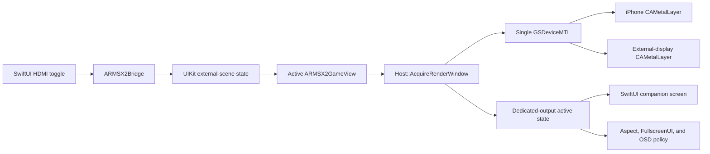

# iOS Dedicated HDMI Output — Upstream PR Handoff

## Purpose

This document consolidates the complete implementation history, final behavior,
architecture, changed areas, validation status, and upstream-integration notes for
the dedicated external-display work now maintained in `moesuito/ARMSX2`.

`HANDOFF.md` is the original implementation handoff and remains the detailed
historical record for the first version of the feature. This document is the
PR-oriented description of the final implementation after the subsequent UI,
localization, OSD, controller, OLED-background, and pause-menu fixes.

The later 2.6.7.1 viewport/scaling hotfix is documented separately in
[`IOS_HDMI_OSD_VIEWPORT_2.6.7.1.md`](IOS_HDMI_OSD_VIEWPORT_2.6.7.1.md).
Its physical-device validation and upstream submission remain intentionally
separate from the already-approved 2.6.7 baseline described here.

## Repository lineage

The first working copy, `moesuito/armsx2-main`, came from a GitHub source ZIP.
It had no upstream Git history and was therefore unsuitable as a pull-request
head. It has been retained privately as the known-working reference.

The PR candidate is now reconstructed in the public, real GitHub fork
<https://github.com/moesuito/ARMSX2>:

- parent: `ARMSX2/ARMSX2`
- upstream base: `71c9ef857976c24c7c01c31a65994a917ea76ca1`
- branch: `feature/ios-dedicated-hdmi-output`
- original ZIP content base identified as:
  `2ed3268f74bd74994ddd0dd3ad44273c2751fc23`

The feature was replayed with three-way merges onto the newer upstream base.
Unrelated ZIP artifacts, missing repository metadata, vendored/submodule
differences, line-ending changes, and Windows project-file noise were not
carried into the fork.

The upstream already contained an equivalent version of the landscape
pause-card safe-area/corner fix. That newer implementation was preserved during
the replay rather than overwritten.

## Final user-facing behavior

The feature adds **Dedicated HDMI Output (Beta)** under **Settings > Graphics >
Display**. The Beta label is present in every supported interface language. It
is disabled by default and persists in the normal INI settings:

```ini
[ARMSX2iOS/UI]
DedicatedExternalDisplay = false
```

The toggle authorizes dedicated output; it does not require an external display
to be present.

| Setting and runtime state | Final behavior |
|---|---|
| Feature disabled | Existing iPhone rendering and normal iOS mirroring behavior are unchanged. |
| Feature enabled, no running VM | Menus remain on the iPhone; no dedicated game surface is requested. |
| Feature enabled, running VM, no external display | Gameplay remains on the iPhone with the original controls and overlays. |
| Feature enabled, running VM, external display connected | The existing Metal renderer migrates to the external display. |
| External display disconnected | The same renderer migrates safely back to the iPhone. |
| Feature disabled while active | Dedicated output is released and gameplay returns to the iPhone. |
| Feature re-enabled while the VM and display remain available | Dedicated output is activated again. |

While dedicated output is actually active:

- The external display receives the game image.
- PCSX2 performance metrics and OSD notifications are rendered on the external
  display when their existing OSD settings enable them.
- FullscreenUI is not rendered on the external display.
- The iPhone becomes a localized companion screen with a true-black,
  safe-area-filling background suitable for OLED displays.
- The companion screen shows an external-display status message and the
  existing pause-menu action.
- The virtual controller and dynamic crosshair are not rendered, regardless of
  whether a Bluetooth controller is connected.
- Existing virtual-pad digital, analog, and touch state is cleared on the
  transition so no input can remain stuck.
- The pause button opens the existing pause menu; no separate save-state or
  emulator-control implementation was introduced.

The special Emulation-Only presentation also uses the black companion surface,
but does not expose the pause button because that mode can intentionally release
the quick-menu resources.

## Architecture

The implementation deliberately reuses the existing renderer. It does not
create a second `GSDeviceMTL`, capture frames, copy textures, or stream a
mirrored image.



### View and renderer ownership

- `g_gameRenderView` remains the stable phone-side view hosted by SwiftUI.
- `s_externalGameRenderView` belongs to the external `UIWindow`.
- `s_activeGameRenderView` is the main-thread-selected, non-owning target used
  by `Host::AcquireRenderWindow()`.
- `MTGS::UpdateDisplayWindow()` tells the existing GS device to detach from the
  old `CAMetalLayer` and attach to the active view.
- The retired external window remains retained until the GS thread has
  processed the surface switch. It is then hidden, detached from its scene, and
  released on the main thread. This prevents the old Metal layer from being
  freed while it is still in use.

### Threading

- UIKit objects, scene lifecycle, window creation, screen-mode selection, and
  active-view selection run on the main thread.
- The CPU thread remains the sole producer of the MTGS command ring.
- UIKit-triggered changes pass through `Host::RunOnCPUThread()` before
  requesting `MTGS::UpdateDisplayWindow()`.
- VM lifecycle callbacks request and release the external presentation.
- The persistent worker can drain CPU-thread work while no game is booted,
  covering toggle and hot-plug transitions near VM startup and teardown.

### Active-state publication

The companion UI is driven by the exact render target acquired by the GS
thread, not merely by the user setting:

- `Host::AcquireRenderWindow()` determines whether the selected view is the
  phone view or the external view.
- `ARMSX2PublishDedicatedExternalDisplayActive()` updates the GS-wide atomic
  state and posts
  `ARMSX2iOSDedicatedExternalDisplayActiveChanged` on the main thread.
- SwiftUI reacts to that notification and retains a 0.5-second polling fallback
  for lifecycle edge cases.

This distinction prevents the phone UI from entering companion mode simply
because the toggle is enabled when no external render surface is active.

## External-scene lifecycle

### iOS 26 and earlier

`PCSX2AppDelegate` routes
`UIWindowSceneSessionRoleExternalDisplayNonInteractive` to the lightweight
`PCSX2ExternalDisplaySceneDelegate`. That delegate does not initialize a second
SDL instance, SwiftUI hierarchy, or VM.

When the feature is disabled, the delegate does not attach a dedicated window,
preserving standard iOS mirroring. When the feature and VM request are both
active, it creates the external window and render view.

### iOS 27 and later

When compiled with an SDK that defines `__IPHONE_27_0`, the root controller
registers an external non-interactive `UISceneAccessory`. The registration is
enabled only while both conditions are true:

```text
DedicatedExternalDisplay && VMRequested
```

Every iOS 27 symbol is protected by both a compile-time SDK guard and an
`@available(iOS 27.0, *)` runtime guard. A build made with the iOS 26 SDK
therefore remains valid but cannot compile or validate the iOS 27 accessory
path.

## Rendering, aspect ratio, refresh rate, and OSD

### Aspect policy

Dedicated output uses the current emulator aspect selection while guaranteeing
a centered fit:

- 4:3, 16:9, 10:7, 21:9, Auto, and custom aspect ratios remain supported.
- `Stretch` resolves to Auto only while dedicated output is active.
- `StretchY`, portrait top alignment, and offset alignment do not distort the
  external result.
- User preferences are not rewritten.
- The external window, root view, Metal view, and Metal clear pass are black,
  producing black pillarbox or letterbox bars.

Pure helper functions were extracted for aspect resolution and fitting. The
added regression test verifies that 4:3 content in 1920×1080 produces
1440×1080 output with 240-pixel bars on both sides, that 16:9 fills 1920×1080,
and that Stretch falls back only for dedicated output.

### Refresh-rate policy

`UIScreenMode` exposes pixel size but not a refresh rate for each mode. The
implementation selects `preferredMode`, reads `currentMode.size`, and reports
`maximumFramesPerSecond`.

Dedicated output makes `GSGetHostRefreshRate()` return `std::nullopt`, so
`SyncToHostRefreshRate` cannot change emulation speed based on a 120 Hz
television. A 50/60 FPS game remains a 50/60 FPS game.

There is no public API that reliably distinguishes 1080p60 from 4K30 in
`availableModes`. The implementation intentionally does not infer refresh rate
from resolution or maintain an adapter-specific lookup table.

### Final OSD policy

The original handoff suppressed all ImGui drawing on the external target. This
was later changed:

- `GSRenderer::EndPresentFrame()` suppresses `FullscreenUI::Render()` only
  while dedicated output is active.
- `ImGuiManager::RenderOSD()` still runs.
- `GSDeviceMTL::EndPresent()` always renders the resulting ImGui draw data.

The result is the existing PCSX2 OSD on the HDMI display when enabled, with no
duplicate metrics overlay on the iPhone companion screen.

## iPhone companion UI

The first follow-up fix covered the stale phone frame with a native placeholder.
That placeholder initially contained labels and could leave the surrounding
SwiftUI surface using the app's grouped gray background.

The final design is:

- A SwiftUI `ExternalDisplayCompanionView` covers the complete phone screen with
  `Color.black.ignoresSafeArea()`.
- The native UIKit placeholder remains as an opaque black safety cover over the
  old Metal view during renderer transitions.
- The message and TV icon are centered.
- The existing pause action appears immediately below the message.
- The button uses the app's native `glassSurface` treatment with a neutral,
  clear material. An explicit blue/accent tint from the intermediate version
  was removed.
- Accessibility labels and a localized pause-menu hint are provided.

No frozen gameplay preview, controller overlay, hardware OSD, or decorative gray
surface remains on the iPhone while dedicated output is active.

## Localization

The setting title, setting description, companion title, companion description,
pause-menu label, and accessibility hint use the app's existing
`SettingsStore.localized(_:)` path.

Translations were added for every language currently exposed by the app:

- System Default
- English
- Simplified Chinese
- Arabic, including the app's existing right-to-left layout direction
- Spanish
- French
- German
- Italian
- Portuguese
- Japanese
- Korean

The native placeholder text from the intermediate implementation was removed,
so UIKit no longer maintains a second localization path for companion content.

## Virtual-controller behavior

Virtual controls and the hardware/metrics OSD are separate rendering systems:

- The virtual controller is SwiftUI and is normally controlled by app settings
  and Bluetooth-controller presence.
- The performance OSD is PCSX2 ImGui content rendered by the GS backend.

When dedicated output becomes active, the entire gameplay layout switches to
the companion view before the virtual controller or crosshair can be composed.
The normal virtual-pad rules remain untouched when dedicated output is inactive.

The transition also calls:

- `VirtualPadTouchActionSession.reset()`
- `EmulatorBridge.resetVirtualPadAnalogInput()`
- `ARMSX2Bridge.resetVirtualPadInput()`

The native reset clears all tracked touch flags, D-pad directions, face buttons,
shoulders, triggers, Start/Select, stick buttons, and both stick directions.

## Pause-menu landscape correction

The final UI fix preserves the same 26-point continuous corner radius in iPhone
landscape that is visible in portrait.

For `landscapePanel`, safe-area top and bottom gutters are now applied outside
the clipped card. Previously the padding participated in the visible background
after clipping, which made the top and bottom edges appear square. Portrait and
iPad layout behavior are unchanged.

## Files and responsibilities

### Initial dedicated-output implementation

The original `HANDOFF.md` documents these areas:

- `platforms/ios/app/src/main/cpp/IOS/AppDelegate.mm`
  - Selects the lightweight external-display scene delegate.
- `platforms/ios/app/src/main/cpp/IOS/PCSX2SceneDelegate.h`
  - Declares `PCSX2ExternalDisplaySceneDelegate`.
- `platforms/ios/app/src/main/cpp/IOS/SceneDelegate.mm`
  - Owns external scene/window state, preferred screen mode, iOS 26 lifecycle,
    guarded iOS 27 scene-accessory lifecycle, activation/deactivation, safe
    renderer retargeting, and the black native phone placeholder.
- `platforms/ios/app/src/main/cpp/IOS/IOSRuntime.h`
  - Declares the native lifecycle/render-view bridge.
- `platforms/ios/app/src/main/cpp/IOS/HostImpls.mm`
  - Selects the active render view, surface dimensions, screen refresh value,
    VM callbacks, active-state publication, and CPU-worker wakeup.
- `platforms/ios/app/src/main/cpp/ios_main.mm`
  - Maintains the stable and active game views and handles active-layer layout.
- `platforms/ios/app/src/main/cpp/ARMSX2Bridge.h`
- `platforms/ios/app/src/main/cpp/ARMSX2Bridge.mm`
  - Expose the setting, exact active state, and virtual-input reset to Swift.
- `platforms/ios/app/src/main/swift/Models/SettingsStore.swift`
  - Persists, loads, resets, and applies the feature live.
- `platforms/ios/app/src/main/swift/Views/Settings/GraphicsSettingsView.swift`
  - Adds the Graphics > Display toggle and description.
- `pcsx2/GS/GS.h`
- `pcsx2/GS/GS.cpp`
  - Store the dedicated-target state and prevent host refresh synchronization.
- `pcsx2/GS/Renderers/Common/GSRenderer.h`
- `pcsx2/GS/Renderers/Common/GSRenderer.cpp`
  - Implement external aspect/fitting policy and final FullscreenUI/OSD policy.
- `tests/ctest/core/gs/external_display_aspect_tests.cpp`
- `tests/ctest/core/gs/CMakeLists.txt`
  - Add the external aspect-fit regression coverage.

### Follow-up UI and localization files

- `platforms/ios/app/src/main/swift/Models/AppLanguage+MainTranslations.swift`
  - Adds every HDMI and companion string to all supported languages.
- `platforms/ios/app/src/main/swift/Views/GameScreenView.swift`
  - Implements the companion screen, exact active-state reaction, virtual-pad
    suppression/reset, and existing pause-menu entry point.
- `platforms/ios/app/src/main/swift/Views/GameOverlayContainer.swift`
  - Fixes landscape pause-card clipping and safe-area gutter placement.
- `platforms/ios/app/src/main/swift/Views/AccessibilityHUDMirror.swift`
  - Was temporarily extended for a phone-side OSD experiment, then restored to
    its original VoiceOver-oriented role and has no HDMI diff in this branch.
- `platforms/ios/app/src/main/swift/Models/SwiftUIHost.swift`
  - Received a temporary native-placeholder localization helper in the legacy
    implementation. That unused helper was removed during the upstream replay
    and has no HDMI diff in this branch.

## Implementation history

| Commit | Description | Final-state relevance |
|---|---|---|
| `89d84928b8` | `feat(ios): add dedicated HDMI output support` | Reconstructed the initial implementation and `HANDOFF.md` as a true upstream-based delta. |
| `981abff462` | `fix(ios): replace frozen phone frame during HDMI output` | Added the first phone-side placeholder to hide the stale Metal frame. |
| `08ad6fa3a0` | `Localize dedicated HDMI output UI` | Added supported-language strings. |
| `c316d8f3b1` | `Keep OSD live on iPhone during HDMI output` | Intermediate phone-side OSD snapshot experiment; superseded by `5e138cf82d`. |
| `5e138cf82d` | `Add HDMI companion screen and external OSD` | Established the final black companion UI, disabled virtual controls during HDMI output, removed the snapshot bridge, and moved the PCSX2 OSD to HDMI. |
| `6d7ade480c` | `Use neutral glass for HDMI pause button` | Removed the unwanted accent tint while preserving the native glass style. |
| `8806aa4084` | `refactor(ios): drop superseded HDMI scaffolding` | Removed residual unused imports/helpers and retained the upstream telemetry flow. |

For an upstream PR, the final source state should be reviewed as one coherent
change. The intermediate phone-side OSD commit remains visible historically,
but none of its snapshot bridge survives in the final diff.

## Validation performed

### Original handoff checks

The initial implementation was prepared in a Windows environment. The following
checks recorded in `HANDOFF.md` passed there:

- `git diff --check`
- XML parsing for `Info.plist.in` and `Entitlements.plist`
- `bash -n platforms/ios/scripts/generate-ios-xcode.sh`
- `bash -n platforms/ios/scripts/build-ios-ipa.sh`
- Static contract checks for the scene delegate, bridge, setting key, SDK/runtime
  guards, external role, and aspect test registration

Objective-C++, Swift, Metal, device, and HDMI execution were not available in
that environment.

### macOS and simulator checks

The implementation and follow-up fixes were subsequently built on:

```text
Xcode 26.6 (17F113)
iPhoneOS SDK 26.5
iPhoneSimulator SDK 26.5
iPhone 17 Pro simulator, iOS 26.5
```

Completed:

- Generated the iOS Xcode project.
- Built the app for the iOS Simulator.
- Installed and launched the app in the iPhone 17 Pro simulator.
- Visually checked the companion and pause-menu layouts in portrait and
  landscape.
- Built the final Release target for `iphoneos` with code signing disabled.
- Packaged and integrity-checked the unsigned IPA.

Per the test plan, gameplay boot and external-display behavior were not treated
as Simulator acceptance criteria because the iOS Simulator does not model this
rendering/JIT/external-display combination reliably.

Local BIOS and game-image fixtures were copied only into a Simulator app
container during development. They are not committed, bundled, or included in
the release artifact.

### Physical-device feedback

After the final UI and OSD fixes, the repository owner completed the manual test
suite on an iPhone 17 Pro Max with JIT enabled and a compatible HDMI adapter.
All tested behavior was reported working:

- Dedicated gameplay rendering switches to HDMI and returns to the iPhone when
  disconnected or disabled.
- OSD metrics appear on HDMI and not on the iPhone.
- The entire iPhone companion background is OLED black.
- Virtual controls remain hidden and do not leave stuck input while HDMI is
  active.
- Pause-menu presentation, settings access, resume, background/foreground, and
  repeated scene connection work.
- Hot-plug, disconnect, disable, and re-enable remain stable.
- Aspect fitting and black bars behave as expected in the tested content.

The subsequent `(Beta)` label and 2.6.7 bundle-version update do not alter the
validated renderer, scene-lifecycle, input, OSD, or companion-screen paths.

### Validation not yet completed

- The iOS 27 `UISceneAccessory` path has not been compiled because the available
  SDK is iOS 26.5.
- The added C++ aspect test was not executed in a configured desktop CTest
  harness during this work.
- Resolution/refresh combinations such as 1080p60, 4K30/60, and 120 Hz have not
  been exhaustively tested across adapters.

## Final unsigned IPA

The current fork artifact was produced from the final source state on
`feature/ios-dedicated-hdmi-output`. The documentation commit made after the
build does not change the executable:

```text
File: ARMSX2-iOS-unsigned.ipa
App: ARMSX2 iOS
Bundle identifier: com.armsx2.ios
Version: 2.6.7 (267)
Minimum iOS: 17.0
Architecture: arm64
Size: 25,669,343 bytes
SHA-256: f497482fc18d27c91ead1a826ced18af58ccf55838a4874bf5123a38515b4083
```

The Release `iphoneos` build completed with Xcode 26.6 and SDK 26.5. The ZIP
payload passes an integrity test, and the contained executable is a 64-bit
arm64 Mach-O. The IPA is deliberately unsigned; it must be signed or re-signed
by the installation workflow, and gameplay still requires the JIT
entitlements/runtime method expected by this iOS port.

No BIOS, game image, save data, or other private test content is present.

## Upstream review checklist

- [x] Reapply the implementation onto a real branch of `ARMSX2/ARMSX2`.
- [x] Exclude unrelated source-ZIP and repository-metadata differences.
- [x] Confirm the superseded phone-OSD snapshot code is absent from the final
      diff.
- [x] Build, install, and launch the Simulator configuration.
- [x] Build and integrity-check the unsigned arm64 device IPA.
- [x] Sign and install the functional HDMI build on an iPhone 17 Pro Max with
      JIT enabled.
- [ ] Run `external_display_aspect_tests.cpp` in the upstream CTest setup.
- [ ] Compile the iOS 27 scene-accessory path with an iOS 27 SDK.
- [x] Test default Off, persistence, mirroring, hot-plug, disconnect, and live
      toggle changes.
- [x] Test aspect fitting, Stretch fallback, and black bars with the available
      manual test content.
- [x] Test OSD off and on; confirm it appears only on HDMI during dedicated
      output.
- [x] Confirm the phone companion is fully black across safe areas in portrait
      and landscape.
- [x] Confirm virtual input is hidden and reset regardless of Bluetooth
      controller state.
- [x] Exercise pause, resume, background/foreground, VM teardown, and repeated
      scene connection.
- [x] Verify the feature on an iPhone 17 Pro Max running iOS 26.
- [ ] Verify the iOS 27+ path on a physical device when available.

## Suggested upstream PR text

### Title

```text
iOS: add dedicated external-display output with HDMI companion UI
```

### Body

```markdown
## Summary

- add an opt-in Dedicated HDMI Output (Beta) setting under Graphics > Display
- move the existing Metal renderer between the iPhone and an external
  non-interactive UIWindowScene without a second renderer or frame copy
- preserve normal iOS mirroring and all existing gameplay UI when the feature is
  disabled or no dedicated target is active
- keep aspect ratio centered, prevent Stretch on the dedicated target, and avoid
  host-refresh changes to emulation speed
- show PCSX2 OSD metrics on HDMI while keeping FullscreenUI off the television
- replace the stale iPhone frame with a localized, OLED-black companion screen
  and the existing pause-menu action
- suppress and reset the virtual controller only while dedicated output is
  active
- support the iOS 26 external-scene lifecycle and the guarded iOS 27
  UISceneAccessory lifecycle

## Testing

- Xcode 26.6 / iPhoneOS and iPhoneSimulator SDK 26.5
- Simulator build, install, and launch on iPhone 17 Pro / iOS 26.5
- unsigned arm64 device Release build and IPA integrity check
- complete manual HDMI suite passed on an iPhone 17 Pro Max with JIT, including
  hot-plug, companion UI, virtual input suppression, pause/resume, and HDMI-only
  OSD
- the guarded iOS 27 SDK path remains to be compiled and validated

## Notes

- the setting defaults to Off
- no BIOS or game assets are included
- the produced development IPA is unsigned and still requires the port's normal
  signing and JIT workflow
```
